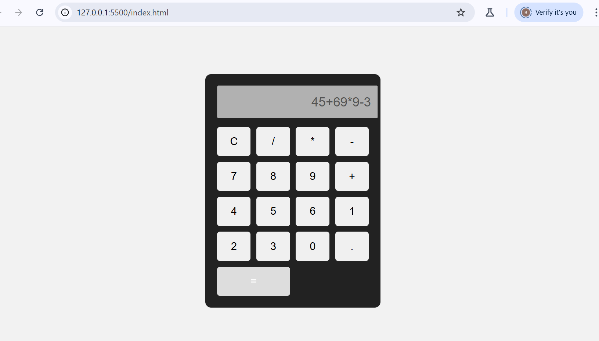

# Web Calculator

## Overview
This project is a simple web-based calculator built using HTML, CSS, and JavaScript. It performs basic arithmetic operations with a clean and responsive interface.

## Project Screenshot

## Features
- Addition
- Subtraction
- Multiplication
- Division
- Clear button

## Technologies Used
- HTML
- CSS
- JavaScript
- web-calculator
##project structure
├── index.html
├── style.css
├── script.js
├── calculator.png
└── README.md

## Author
Bhargavi
